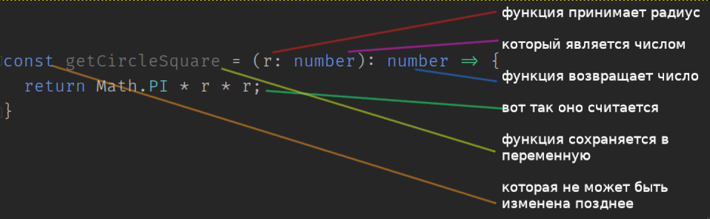

# Typescript

## Отличия от python

1. Typescript транслируется в javascript. То есть
    - вы пишете код в каталог `./src`
    - вы запускаете watcher, который перекладывает файлы из каталога `./src` в каталог `./dist`
    - и выполняет код из каталога `./dist`
    
    Аналогичный процесс вы видели, когда писали сайт: там scss транслировался в css.

2. Typescript типизирован явно

    Тип должен быть указан у каждой переменной и у каждой функции явно.

| python                                                                                                  | typescript                                                                                                             |
|:--------------------------------------------------------------------------------------------------------|:-----------------------------------------------------------------------------------------------------------------------|
| `a = 2`                                                                                                 | `const a = 2;`                                                                                                         |
| `a = True`                                                                                              | `const a = true;`                                                                                                      |
| `a = 'asd'`                                                                                             | `const a = 'asd';`                                                                                                     |
| <code>def foo():<br />&nbsp;&nbsp;&nbsp;&nbsp;return 0</code>                                           | `const foo = (): number => 0;`                                                                                                 |
| <code>import math<br />def get_circle_square(r):<br />&nbsp;&nbsp;&nbsp;&nbsp;return math.pi * r * r</code> | <code>const getCircleSquare = (r: number): number => {<br />&nbsp;&nbsp;&nbsp;&nbsp;return Math.PI * r * r;<br />}</code> |

В первых трёх примерах я не указываю тип, хотя могу это сделать: полная форма всё-таки будет `const a: number = 2`. Но typescript достаточно умён, чтобы понять, что `2` - это и так `number`, поэтому можно писать `const a = 2`.

Поэлементно разберу последний пример с функцией. Обратите внимание, насколько здесь явно выделяется сигнатура функции.



Функция, которая содержит только одну строчку, может быть записана в более коротком синтаксисе. Неважно какой использовать; линтер будет настроен на полную форму, хотите - поменяйте.

```ts
const long = (): number => {
    return 0;
}

const short = (): number => 0;
```

3. Линтер

  Каждому нравится разный стиль написания кода: отступ в два пробела или в четыре? имена с большой буквы или с маленькой? Неважно, какого стиля вы придерживаетесь - важно, чтобы была кнопка, которая автоматически сделает как надо. Это кнопка называется "линтер".

   Сейчас всё настроено так, что если вы напишете в консоле `yarn lint --fix`, то ваш код будет автоматически приведён к некоей общеприемлимой форме. Это работает так:
   - я поставил пакет eslint: `yarn add --dev eslint`
   - я создал файл `.eslintrc.json`, в котором описал то, как код должен линтоваться
   - я создал файл `.eslintignore`, в котором указал файлы, которые надо игнорировать - всё, кроме моего каталога `./src`
   - я добавил в `package.json` строку `"lint": "eslint --ext .ts ./src"`
   
   Список правил можно найти на сайте [eslint](https://eslint.org/docs/rules/). Более делальных статей по линтеру написано очень много, почитайте чего-нибудь.

## Задания

### Разобраться с typescript

Порешайте на typescript задачи, которые у вас уже решены на python. Это позволит вам сосредоточиться на самом языке. В принципе, в 95% случаев будет достаточно заменить код по таблице выше.

Для помощи я переписал задачку про площадь круга с [python](https://github.com/saratov-las-robotics/python-tasks/blob/master/src/circle.py) на [typescript](src/circle.ts)

### json

Напишите программу, сохраняющую своё состояние между запусками. То есть чтобы вы в ней что-нибудь поменяли, закрыли программу, открыли - а там всё сохранилось. Например, напишите электроннуя библиотеку.

Это будет программа, в которой можно:
- добавить книгу
- посмотреть список книг

При каждом изменении списка книг сохраняйте его в json (сериализуйте) в файл.
